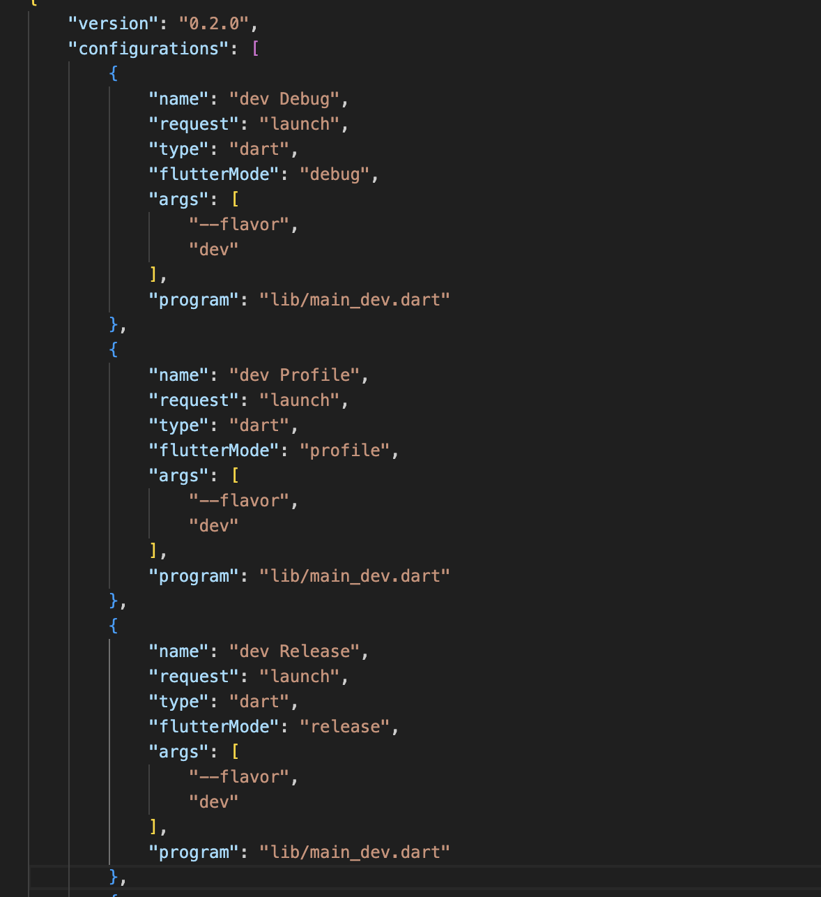

# Enterprise - Production setup
1. Clean code architecture (Bloc, GetIt, Secure storage)
2. Shared Preference & Secure storage
3. Theme
4. Localization
5. Flavors
6. CI/CD Github Actions

# Flavors - (Dev, Staging, Production)

 - Adding in .vscode -> launch.json file
   